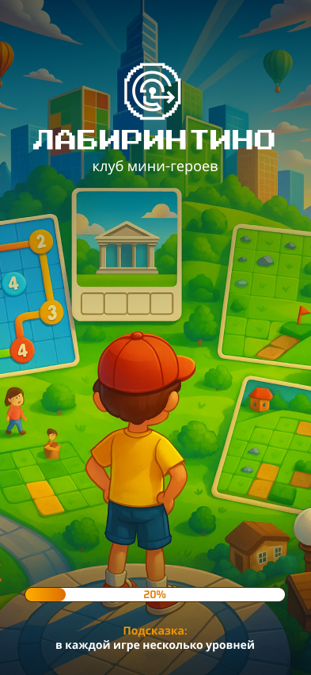
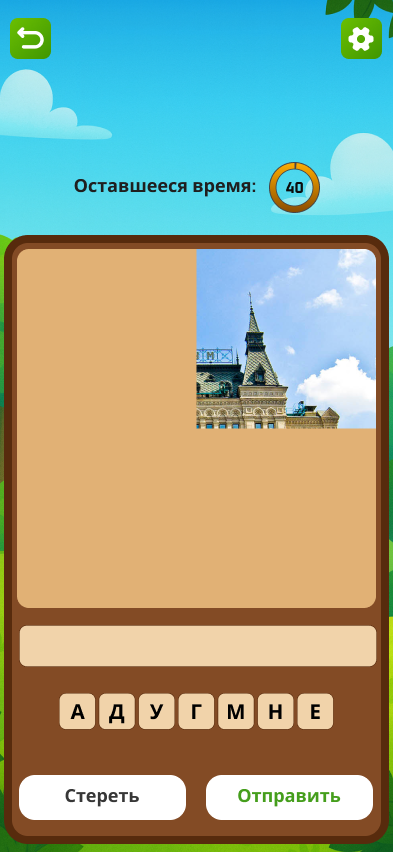
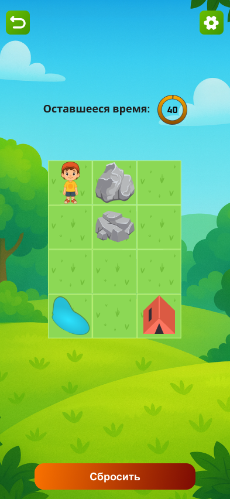
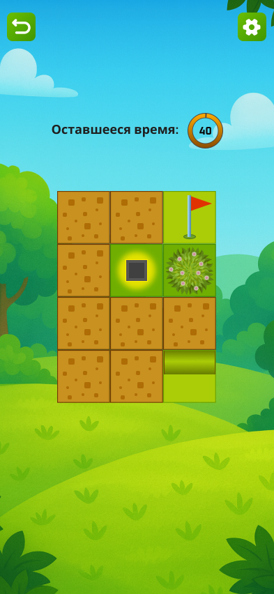
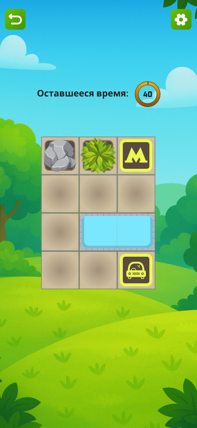
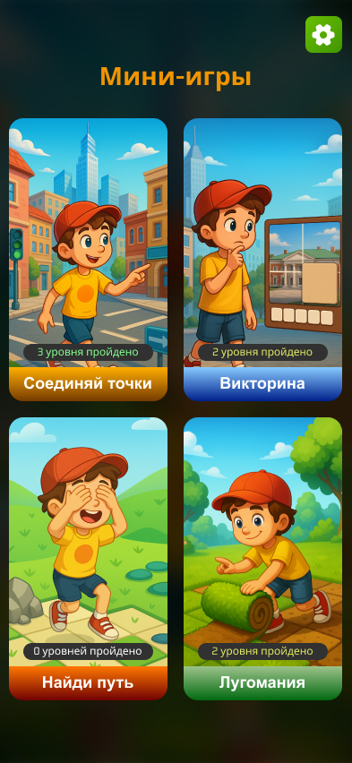
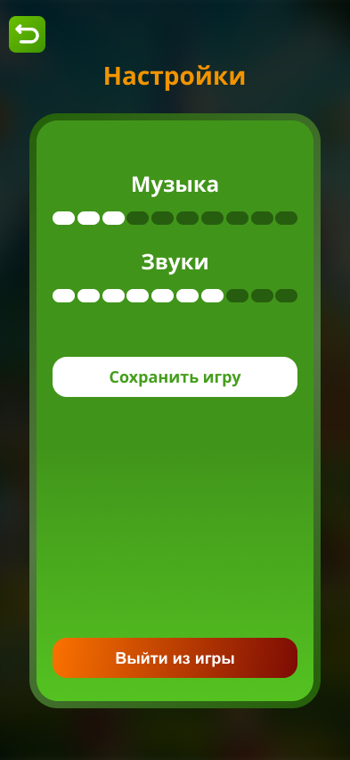

# 🧩 Лабиринтино — сборник мини-игр для развития логики

**Лабиринтино** — это сборник из 4 уникальных 2D-головоломок для мобильных устройств (Android). Проект разработан на **Unity** и представляет собой набор изолированных мини-игр, объединённых общей системой прогресса, настроек и сохранений.


*Главное меню с выбором мини-игр*

---

## 🎮 Содержание

- [Об игре](#-об-игре)
- [Мини-игры](#-мини-игры)
- [Скриншоты](#-скриншоты)
- [Технологии](#-технологии)
- [Архитектура](#-архитектура)
- [Установка и запуск](#-установка-и-запуск)

---

## 🧠 Об игре

**Лабиринтино** — это образовательная казуальная игра, в которой игроку предстоит пройти серию интеллектуальных испытаний. Каждая мини-игра тренирует разные когнитивные навыки: память, логику, внимание и пространственное мышление.

**Ключевые особенности:**
- 🎯 4 уникальные мини-игры с возрастающей сложностью
- 📊 Система сохранения прогресса и монет
- 🔊 Настройки громкости музыки и звуковых эффектов
- 📱 Вертикальная ориентация, оптимизированная для телефонов
- 💾 Автоматическое сохранение после каждой победы

---

## 🕹️ Мини-игры

### 1. 🏛️ Викторина
Угадайте название известного архитектурного сооружения по фрагменту его изображения.

**Механика:**
- Фрагмент изображения постепенно открывается с каждой ошибкой
- Набор букв для составления ответа (динамическая генерация)
- 3 попытки на уровень
- Таймер 40 секунд



---

### 2. 🗺️ Найди путь
Восстановите правильный маршрут от старта до финиша по памяти.

**Механика:**
- Кратковременная демонстрация правильного пути (3 секунды)
- Сетка с препятствиями
- Пошаговое построение маршрута
- Возможность сбросить путь и попробовать снова



---

### 3. 🌿 Лугомания
Превратите все коричневые участки в зелёный луг за ограниченное время.

**Механика:**
- Клетки случайным образом распределены на старте
- Одно касание — превращение коричневой клетки в зелёную
- Таймер 40 секунд
- Победа при озеленении всех клеток



---

### 4. 🔗 Соединяй точки
Постройте маршрут, соединяющий все обязательные точки, избегая препятствий.

**Механика:**
- Свободное построение маршрута (тап или свайп)
- Нельзя проходить дважды по одной клетке
- Препятствия (непроходимые клетки)
- Порядок посещения точек — свободный



---

## 📸 Скриншоты

| Главное меню | Выбор игры | Настройки |
|--------------|------------|-----------|
|  |  |  |

| Викторина | Найди путь | Лугомания | Соединяй точки |
|-----------|------------|-----------|----------------|
|  |  |  |  |

---

## 🛠️ Технологии

| Компонент | Используемые технологии |
|-----------|------------------------|
| **Движок** | Unity 2022.3 LTS (или ваша версия) |
| **Язык** | C# |
| **Платформа** | Android (вертикальная ориентация) |
| **UI** | Unity Canvas, TextMeshPro |
| **Сохранения** | PlayerPrefs (с базовой обфускацией) |
| **Аудио** | Unity Audio Mixer |

---

## 🏗️ Архитектура

Проект построен на принципах **слабой связанности** и **инъекции зависимостей** через инициализацию. Основные архитектурные решения:
```text
┌─────────────────────────────────────────────────────────┐
│ GameManager │
│ (Синглтон, DontDestroyOnLoad) │
│ ┌──────────────────────────────────────────────────┐ │
│ │ Service Locator │ │
│ │ - AudioService │ │
│ │ - SaveService │ │
│ └──────────────────────────────────────────────────┘ │
└─────────────────────────────────────────────────────────┘
│
│ Initialize(manager, audio, save)
▼
┌─────────────────────────────────────────────────────────┐
│ MiniGameBase (абстрактный) │
│ - StartGame() / EndGame() │
│ - Victory() / Defeat() │
└─────────────────────────────────────────────────────────┘
│ │ │ │
▼ ▼ ▼ ▼
```
QuizGame PathGame MeadowGame DotsGame

```text

**Ключевые паттерны:**
- **Service Locator** — для доступа к глобальным сервисам
- **Template Method** — через базовый класс `MiniGameBase`
- **Object Pool** — для кнопок с буквами в игре "Викторина"
- **Event-driven** — для обновления UI и синхронизации
```

---

## 🚀 Установка и запуск

### Требования
- Unity 2022.3.63f LTS или новее
- Android SDK (для сборки на телефон)

### Инструкция

1. **Клонируйте репозиторий**
   ```bash
   git clone https://github.com/ваш-аккаунт/labirintino.git
   cd labirintino
   ```

👥 Разработал
- Магомедов Абдулатип
